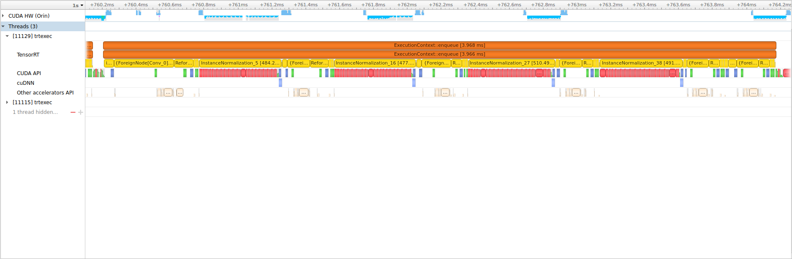
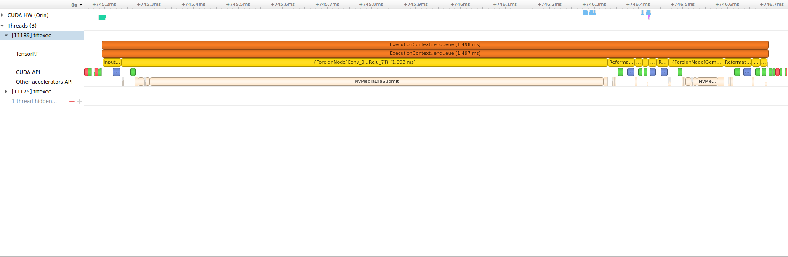

<!-- 
SPDX-FileCopyrightText: Copyright (c) 2022 NVIDIA CORPORATION & AFFILIATES. All rights reserved.
SPDX-License-Identifier: MIT
 -->

# Getting started with the Deep Learning Accelerator on NVIDIA Jetson Orin

In this tutorial, we’ll develop a neural network that utilizes the Deep Learning Accelerator (DLA) on Jetson Orin.  In case you’re unfamiliar, the DLA is an application specific integrated circuit on Jetson Xavier and Orin that is capable of running common deep learning inference operations, such as convolutions.  This dedicated hardware is power efficient, and allows you to offload work from the GPU, freeing it for other tasks.  If you’re interested in better utilizing the full capabilities of your Jetson platform, this tutorial is for you.

To demonstrate how to use the DLA, we’ll run through the entire modeling process; from designing and training an architecture in PyTorch, to calibrating the model for INT8 precision, to profiling and validating the model.  We hope this will give you a better understanding of how to use the DLA, as well as its capabilities and limitations.  Understanding this information early on is important, as it will help you make design decisions to ensure your model can be easily accelerated by the DLA, enabling you to further unlock the capabilities of Jetson Orin.

Let’s get started!

> Tip:  You can easily recreate the models covered in this tutorial yourself!  Check out [``QUICKSTART.md``](QUICKSTART.md) for instructions on how to use the code contained in this repository.

## Overview

- [Step 1 - Define a model in PyTorch](#step-1)
- [Step 2 - Export the model to ONNX](#step-2)
- [Step 3 - Optimize the untrained model using TensorRT](#step-3)
- [Step 4 - Profile with Nvidia Visual Profiler](#step-4)
- [Step 5 - Modify model for better DLA utilization](#step-5)
- [Step 6 - Train the model](#step-6)
- [Step 7 - Optimize the model (using real weights and calibration data)](#step-7)
- [Step 8 - Evaluate the accuracy of the optimized model](#step-8)
- [Step 9 - Modify trained model with ONNX graph surgeon](#step-9)
- [Next Steps](#next-steps)


<a id="step-1"></a>
## Step 1 - Define a model in PyTorch

First, let’s define our PyTorch model.  We’ll create a simple CNN image classification model targeting the CIFAR10 dataset.  To demonstrate the process of identifying and replacing unsupported layers, we will intentionally use the GroupNorm normalization layer, which is not currently supported by the DLA.

```python
class ModelGN(nn.Module):
    def __init__(self, num_classes):
        super().__init__()
        self.cnn = nn.Sequential(
            nn.Conv2d(3, 64, kernel_size=3, stride=2, padding=1),
            nn.GroupNorm(8, 64),
            nn.ReLU(),
            nn.Conv2d(64, 128, kernel_size=3, stride=2, padding=1),
            nn.GroupNorm(8, 128),
            nn.ReLU(),
            nn.Conv2d(128, 256, kernel_size=3, stride=2, padding=1),
            nn.GroupNorm(8, 256),
            nn.ReLU(),
            nn.Conv2d(256, 512, kernel_size=3, stride=2, padding=1),
            nn.GroupNorm(8, 512),
            nn.ReLU()
        )
        self.pool = nn.AdaptiveAvgPool2d((1, 1))
        self.linear = nn.Linear(512, num_classes)

    def forward(self, x):
        x = self.cnn(x)
        x = self.pool(x)
        x = x.view(x.shape[0], -1)
        x = self.linear(x)
        return x

model_gn = ModelGN(num_classes=10).cuda().eval()
```

That’s it, our initial PyTorch model is now defined.  We could proceed with training this model, but often training is a time consuming task.  Instead, let’s try running our model on the DLA with TensorRT with dummy weights, just to see how it performs.

<a id="step-2"></a>
## Step 2 - Export the model to ONNX

To run our model on the DLA, we need to use the TensorRT neural network inference library by NVIDIA.  TensorRT is a framework that ingests a neural network graph description, and performs a variety of platform specific optimizations, including but not limited to running layers on the DLA.  The optimizations result in a TensorRT engine, which may be executed using the TensorRT runtime.

There are a few different utilities for converting and building TensorRT engines from PyTorch models, each with their own benefits.  Here we will use the PyTorch -> ONNX -> TensorRT workflow.  To do this, we first export our model to ONNX as follows

```python
data = torch.zeros(1, 3, 32, 32).cuda()

torch.onnx.export(model_gn, data, 'model_gn.onnx',
    input_names=['input'],
    output_names=['output'],
    dynamic_axes={
        'input': {0: 'batch_size'},
        'output': {0: 'batch_size'}
    }
)
```

Note that we specify dynamic axes for the input and output batch dimensions.  By enabling dynamic batch axes, we can then generate a TensorRT engine which is capable of using batch sizes larger than the size of the example data used when exporting to ONNX.

<a id="step-3"></a>
## Step 3 - Optimize the untrained model using TensorRT

To build our TensorRT engine, we can use the trtexec tool, which is installed on Jetson at the location /usr/src/tensorrt/bin/trtexec.  Let’s create an alias for this

```bash
alias trtexec=/usr/src/tensorrt/bin/trtexec
```

Now, we can call trtexec and specify the parameters we wish to use for optimization.  The command we use is as follows

```bash
trtexec --onnx=model_gn.onnx --shapes=input:32x3x32x32 --saveEngine=model_gn.engine --exportProfile=model_gn.json --int8 --useDLACore=0 --allowGPUFallback --useSpinWait --separateProfileRun > model_gn.log
```

- ``--onnx`` - The input ONNX file path.
- ``--shapes`` - The shapes for input bindings, we specify a batch size of 32.
- ``--saveEngine`` - The path to save the optimized TensorRT engine.
- ``--exportProfile`` - The path to output a JSON file containing layer granularity timings.
- ``--int8`` - Enable INT8 precision.  This is required for best performance on Orin DLA.
- ``--useDLACore=0`` - The DLA core to use for all compatible layers.
- ``--allowGPUFallback`` - Allow TensorRT to run layers on GPU that aren't supported on DLA.
- ``--useSpinWait`` - Synchronize GPU events, for improved profiling stability.
- ``--separateProfileRun`` - Perform a separate run for layer profiling.
- ``> model_gn.log`` - Capture the output into a file named ``model_gn.log``

The ``trtexec`` program will log information related to the optimization and profiling processes.  One notable output is the collection of layers running on the DLA.  After calling ``trtexec`` to build and profile our model on GPU, we see the following output

```bash
[03/31/2022-14:34:54] [I] [TRT] ---------- Layers Running on DLA ----------
[03/31/2022-14:34:54] [I] [TRT] [DlaLayer] {ForeignNode[Conv_0]}
[03/31/2022-14:34:54] [I] [TRT] [DlaLayer] {ForeignNode[Relu_10...Conv_11]}
[03/31/2022-14:34:54] [I] [TRT] [DlaLayer] {ForeignNode[Relu_21...Conv_22]}
[03/31/2022-14:34:54] [I] [TRT] [DlaLayer] {ForeignNode[Relu_32...Conv_33]}
[03/31/2022-14:34:54] [I] [TRT] [DlaLayer] {ForeignNode[Relu_43]}
[03/31/2022-14:34:54] [I] [TRT] ---------- Layers Running on GPU ----------
[03/31/2022-14:34:54] [I] [TRT] [GpuLayer] SHUFFLE: Reshape_2 + (Unnamed Layer* 7) [Shuffle]
[03/31/2022-14:34:54] [I] [TRT] [GpuLayer] PLUGIN_V2: InstanceNormalization_5
[03/31/2022-14:34:54] [I] [TRT] [GpuLayer] SHUFFLE: (Unnamed Layer* 12) [Shuffle] + Reshape_7
[03/31/2022-14:34:54] [I] [TRT] [GpuLayer] SCALE: 71 + (Unnamed Layer* 16) [Shuffle] + Mul_8
[03/31/2022-14:34:54] [I] [TRT] [GpuLayer] SCALE: 72 + (Unnamed Layer* 19) [Shuffle] + Add_9
[03/31/2022-14:34:54] [I] [TRT] [GpuLayer] SHUFFLE: Reshape_13 + (Unnamed Layer* 29) [Shuffle]
```

As we can see, several layers are running on the DLA as well as the GPU.  This indicates that our many layers were not compatible for execution on the DLA, and fell back to execution on the GPU.  Contiguous subgraphs that execute on the DLA will appear as one "ForeignNode" block.  Ideally, our entire model would appear as a single "ForeignNode" entry running on the DLA.

In addition to this information, ``trtexec`` will report the number of batches executed per second.

```bash
[03/31/2022-15:12:38] [I] === Performance summary ===
[03/31/2022-15:12:38] [I] Throughput: 305.926 qps
```

Here we see that the engine executes ``305.926`` batches per second.  Multiplying this number by the batch size results in the number of images per second.

This coarse information is useful for determining how fast a model will run in practice, but provides little insight into what we can do to improve the model performance.

Let's take a look at how we can use the Nvidia Visual Profiler, to provide a timeline trace of
what's happening during our model execution.

<a id="step-4"></a>
## Step 4 - Profile with Nvidia Visual Profiler

To collect data for visualization, we first need to profile our model.  To do this, we will use the ``nsys`` command line tool installed by on the NVIDIA Jetson Orin.  This tool is capable of collecting system profiling information during the execution of a provided program.

We will call ``nsys profile`` using ``/usr/src/tensorrt/bin/trtexec`` as the executable to be profiled.  We will provide the engine we've already created in the previous step to ``trtexec`` to avoid profiling the entire optimization process.

```bash
nsys profile --trace=cuda,nvtx,cublas,cudla,cusparse,cudnn,nvmedia --output=model_gn.nvvp /usr/src/tensorrt/bin/trtexec --loadEngine=model_gn.engine --iterations=10 --idleTime=500 --duration=0 --useSpinWait
```

The notable ``nsys profile`` parameters are 

- ``--trace`` - Determines which events we want to capture during our profiling session.  Notably, ``nvmedia`` will capture calls to the DLA.  ``nvtx`` will capture application specific calls, which in this instance includes TensorRT layer executions.
- ``--output=model_gn`` - Sets the output file that profiling information will be stored in.  This can be directly loaded with the NVIDIA Visual Profiler.

The ``trtexec`` parameters are 

- ``--loadEngine=model_gn.engine`` - The path of the TensorRT engine we previously generated by calling ``trtexec`` with ``--saveEngine``
- ``--iterations=10`` - Limit the number of iterations to 10, since we are interested in the fine-grained execution timeline, not larger statistical information.
- ``--duration=0`` - Removes the minimum profiling duration, we only wish to profile 10 executions.
- ``--idleTime=500`` - Adds a ``500ms`` wait time between executions, so we can more easily distinguish separate execution calls in the timeline view.
- ``--useSpinWait`` - Adds explicit synchronization to improve profiling stability

After calling the profiling command, we will generate the profiling data which we load into NVIDIA Visual Profiler.  

Focusing on a single model execution call we see the following.



The orange block, which is recorded when specifying ``--trace=nvtx``, shows the entire TensorRT engine execution call.  The yellow blocks, which are also captured by specifying ``--trace=nvtx``, show the individual TensorRT layer executions.  The blocks in the row titled *Other Accelerators API* shows the DLA events.  As we can see, the DLA events are rather spaced out, with a variety of other events happening in between.  These other events take a significant portion of our model execution time.

In this instance, the events in-between our DLA events are caused by the GraphNorm layer, which isn't supported by the DLA. The data is formatted for execution on the GPU, and the formatted again for execution on the DLA between each DLA block.  This overhead, since it recurs several times in our model, increases our overall runtime significantly.

Determining which layer isn't supported by the DLA can be done by referencing warnings output from ``trtexec`` or even inspecting the kernel names in the profiling view for hints.  Sometimes the layer names don't map exactly to the original PyTorch layer, which can make this process more challenging.  In this instance, substituting or removing layers and testing the conversion can provide a definitive indication of what is supported or problematic.

> Tip: Though not covered here, the TensorRT Python API allows you to inspect which TensorRT layers in the TensorRT network definition are able to run on the DLA.  We'll cover how to parse the ONNX model into a TensorRT network later in this tutorial.  You could use this representation to programatically check which layers are supported by the DLA in Python.  However, associating this information with the original PyTorch model may still present some challenge, because layers may be mapped from PyTorch to ONNX / TensorRT under different representation.  In these instances, sometimes iterativelly testing the conversion of submodules in your model is the easiest way to hone-in on an incompatible layer.

By this analysis, we see that the GroupNorm layer, which has relatively low computational complexity, is introducing significant runtime do to the formatting overhead between GPU and DLA.  

Let's try a different layer, that *is* supported by the DLA, to see how it improves our model performance.

<a id="step-5"></a>
## Step 5 - Modify model for better DLA utilization

First, we modify our model definition, replacing all ``GroupNorm`` norm layers with ``BatchNorm2d`` layers.  

```python
class ModelBN(nn.Module):
    def __init__(self, num_classes):
        super().__init__()
        self.cnn = nn.Sequential(
            nn.Conv2d(3, 64, kernel_size=3, stride=2, padding=1),
            nn.BatchNorm2d(64),
            nn.ReLU(),
            nn.Conv2d(64, 128, kernel_size=3, stride=2, padding=1),
            nn.BatchNorm2d(128),
            nn.ReLU(),
            nn.Conv2d(128, 256, kernel_size=3, stride=2, padding=1),
            nn.BatchNorm2d(256),
            nn.ReLU(),
            nn.Conv2d(256, 512, kernel_size=3, stride=2, padding=1),
            nn.BatchNorm2d(512),
            nn.ReLU()
        )
        self.pool = nn.AdaptiveAvgPool2d((1, 1))
        self.linear = nn.Linear(512, num_classes)

    def forward(self, x):
        x = self.cnn(x)
        x = self.pool(x)
        x = x.view(x.shape[0], -1)
        x = self.linear(x)
        return x

model_bn = ModelBN(num_classes=10).cuda().eval()
```

Second, we export our model to ONNX as before.

```python
data = torch.zeros(1, 3, 32, 32).cuda()

torch.onnx.export(model_bn, data, 'model_bn.onnx',
    input_names=['input'],
    output_names=['output'],
    dynamic_axes={
        'input': {0: 'batch_size'},
        'output': {0: 'batch_size'}
    }
)
```

Third, we build and profile our TensorRT engine as before

```bash
trtexec --onnx=model_bn.onnx --shapes=input:32x3x32x32 --saveEngine=model_bn.engine --exportProfile=model_bn.json --int8 --useDLACore=0 --allowGPUFallback --useSpinWait --separateProfileRun > model_bn.log
```

Which outputs

```bash
[03/31/2022-15:12:48] [I] [TRT] ---------- Layers Running on DLA ----------
[03/31/2022-15:12:48] [I] [TRT] [DlaLayer] {ForeignNode[Conv_0...Relu_7]}
[03/31/2022-15:12:48] [I] [TRT] [DlaLayer] {ForeignNode[Gemm_15 + linear.bias + (Unnamed Layer* 19) [Shuffle] + unsqueeze_node_after_linear.bias + (Unnamed Layer* 19) [Shuffle]_(Unnamed Layer* 19) [Shuffle]_output + (Unnamed Layer* 20) [ElementWise]]}
[03/31/2022-15:12:48] [I] [TRT] ---------- Layers Running on GPU ----------
[03/31/2022-15:12:48] [I] [TRT] [GpuLayer] REDUCE: GlobalAveragePool_8
[03/31/2022-15:12:48] [I] [TRT] [GpuLayer] SHUFFLE: copied_squeeze_after_(Unnamed Layer* 20) [ElementWise]
```

As we can see, there are significantly fewer layers running on the GPU as well as the DLA.  This is an indication that more layers (Conv_0...Relu_7) were merged into a single "ForeignNode" block for execution on the DLA.  

This is a good sign!  And as seen below, the performance of our model has approximately doubled!

```bash
[03/31/2022-15:12:55] [I] === Performance summary ===
[03/31/2022-15:12:55] [I] Throughput: 649.723 qps
```

We profile this new engine as we did before with the following command

```bash
nsys profile --trace=cuda,nvtx,cublas,cudla,cusparse,cudnn,nvmedia --output=model_bn.nvvp /usr/src/tensorrt/bin/trtexec --loadEngine=model_bn.engine --iterations=10 --idleTime=500 --duration=0 --useSpinWait
```

As we see below, a majority of the model execution now occurs in one large block under the "Other accelerators API" row.  This indicates our model is utilizing the DLA much more effectively!



Until this point, we've been working with dummy model weights.  However, to obtain the best performance on the DLA, we need to use INT8 precision for our model.  Reducing the precision of a neural network can impact the accuracy of the model.  To mitigate this effect, it is important to perform calibration.  

Let's go over how to train the model, and perform calibration with real data.

<a id="step-6"></a>
## Step 6 - Train the model

First, we train the model on the CIFAR10 dataset.  This is a toy image classification dataset, which has examples in PyTorch available from a variety of sources online.  

Since this step isn't unique to execution on the DLA, we won't past code inline.  However,
we have provided a training script [``train.py``](train.py) that may be used to generate the trained neural network weights.  The usage of ``train.py`` is covered in [``QUICKSTART.md``](QUICKSTART.md).  To train our new batch norm model, we simply call

```bash
python3 train.py model_bn --checkpoint_path=data/model_bn.pth
```

The trained model weights are stored at ``model_bn.pth``.  This model reaches an accuracy of roughly ``85%`` on the CIFAR10 test dataset.  While other architectures can obtain better accuracy on this dataset, we've opted for a simple model since our focus only on validating that the DLA workflow and verifying that the calibrated DLA engine obtains similar accuracy to it's PyTorch counterpart.

Once we have the trained weights, ``model_bn.pth`` we can export the model to ONNX as before.

```python
model = ModelBN()
model.load_state_dict(torch.load('model_bn.pth'))

torch.onnx.export(
    model,
    data,
    'model_bn.onnx',
    input_names=['input'],
    output_names=['output'],
    dynamic_axes={
        'input': {0: 'batch_size'},
        'output': {0: 'batch_size'}
    }
)
```

Now, our trained model, in ONNX representation, is stored at ``model_bn.onnx``.  

Let's proceed with optimizing our trained model.

<a id="step-7"></a>
## Step 7 - Optimize the model (using real weights and calibration data)

To optimize our trained model, we'll use the TensorRT Python API, rather than trtexec.  The reason for this decision is, that we'll need to provide a Python interface for generating calibration data.

To start, we import the TensorRT Python package, and make the required API calls to parse our ONNX model into a TensorRT network.

```python
import tensorrt as trt

# create logger
logger = trt.Logger(trt.Logger.INFO)

# create builder
builder = trt.Builder(logger)

# create network, enabling explicit batch
network = builder.create_network(1 << int(trt.NetworkDefinitionCreationFlag.EXPLICIT_BATCH))

# parse the ONNX model to generate the TensorRT network
parser = trt.OnnxParser(network, logger)

with open(args.onnx, 'rb') as f:
    parser.parse(f.read())
```

Now, our ``network`` class holds a full representation of our trained model.  This representation however, is not executable.  TensorRT still needs to optimize the model to produce the TensorRT *engine*, which stores the output of our optimization process.  The engine describes which tactics are used to execute the layers in our network, including which sub-graphs are offloaded to the DLA for execution. 

There are a variety of configuration options we may provide to control the optimization process.  These parameters are largerly controled through a configuration class which may be created as follows.

```python
config = builder.create_builder_config()
```

Now that our ``config`` instance is defined, we'll first set the optimization profile.

```python
batch_size = 32

# define the optimization configuration
profile = builder.create_optimization_profile()
profile.set_shape(
    'input',
    (batch_size, 3, 32, 32),            # min shape
    (batch_size, 3, 32, 32),   # optimal shape
    (batch_size, 3, 32, 32)    # max shape
)

config.add_optimization_profile(profile)
```

This profile determines controls the shapes of input tensors that our final engine will be capable of handling.  These shapes include a minimum, optimal, and maximum shape.  The minimum and maximum shape control which shapes are allowed by the model, while the optimal shape controls which shape is used during the profiling and tactic selection process.  In order for the DLA to be selected as a tactic, we must set all these shapes to be the same.

Next, we specify which DLA core we want our model to run on by default, and allow GPU fallback in case DLA layers are not supported.
```python
config.dla_core = 0
config.set_flag(trt.BuilderFlag.GPU_FALLBACK)
```

Finally, since DLA is supported only for ``INT8`` and ``FP16`` precisions, we enable ``INT8`` precision.

```python
config.set_flag(trt.BuilderFlag.INT8)
```

Next, we create a class ``DatasetCalibrator`` that will be used to provide calibration data to the TensorRT builder.  This class wraps the CIFAR10 dataset we used for training, and implements the IINT8Calibrator interface to provide batches of data for calibration.  By implementing the ``get_batch``, ``get_algorithm``, and ``get_batch_size`` methods of the ``IInt8Calibrator`` interface, our class may now be used by the TensorRT builder.

```python
import torch
import tensorrt as trt
import torchvision.transforms as transforms


class DatasetCalibrator(trt.IInt8Calibrator):
    
    def __init__(self, 
            input, dataset, 
            algorithm=trt.CalibrationAlgoType.ENTROPY_CALIBRATION_2):
        super(DatasetCalibrator, self).__init__()
        self.algorithm = algorithm
        self.dataset = dataset
        self.buffer = torch.zeros_like(input).contiguous()
        self.count = 0
        
    def get_batch(self, *args, **kwargs):
        if self.count < len(self.dataset):
            for buffer_idx in range(self.get_batch_size()):

                # get image from dataset
                dataset_idx = self.count % len(self.dataset)
                image, _ = self.dataset[dataset_idx]
                image = image.to(self.buffer.device)

                # copy image to buffer
                self.buffer[buffer_idx].copy_(image)

                # increment total number of images used for calibration
                self.count += 1

            return [int(self.buffer.data_ptr())]
        else:
            return []  # returning None or [] signals to TensorRT that calibration is finished
        
    def get_algorithm(self):
        return self.algorithm
    
    def get_batch_size(self):
        return int(self.buffer.shape[0]) 
    
    def read_calibration_cache(self, *args, **kwargs):
        return None
    
    def write_calibration_cache(self, cache, *args, **kwargs):
        pass
```

Next, we instantiate our ``DatasetCalibrator`` using the CIFAR10 training dataset (which is the same that we used for training) and assign it to ``config.int8_calibrator``

```python
transform = transforms.Compose([
    transforms.ToTensor(),
    transforms.Normalize((0.4914, 0.4822, 0.4465), (0.2023, 0.1994, 0.2010)),
])

train_dataset = torchvision.datasets.CIFAR10(
    root=os.path.join(args.data_dir, 'cifar10'), 
    train=True,
    download=True, 
    transform=transform
)

batch_size = 32

data = torch.zeros(batch_size, 3, 32, 32).cuda()

config.int8_calibrator = DatasetCalibrator(data, train_dataset)
```

Finally, build our TensorRT engine using the network we generated from our ONNX file, and the configuration we defined above.  

```python
engine_bytes = builder.build_serialized_network(network, config)
```

After the optimization process is finished, we save our engine to disk.

```python
with open('model_bn.engine', 'wb') as f:
    f.write(engine_bytes)
```

Our optimized, calibrated, INT8 / DLA compatbile TensorRT engine is now stored at
``model_bn.engine``.


You could now use this optimized engine with a variety of inferences APIs, such as deepstream, or Triton inference server.

Here we'll use the TensorRT Python API to run inference using our model, and evaluate the accuracy on the CIFAR10 test dataset.

<a id="step-8"></a>
## Step 8 - Evaluate the accuracy of the optimized model

First, let's define the CIFAR10 test dataset classes.

### Define the test dataset

```python
test_dataset = torchvision.datasets.CIFAR10(
    root=os.path.join(args.data_dir, 'cifar10'), 
    train=False,
    download=True, 
    transform=transform
)

test_loader = torch.utils.data.DataLoader(
    test_dataset, 
    batch_size=batch_size,
    shuffle=False
)
```

Next, let's instantiate the TensorRT runtime, load our saved TensorRT engine,
and create the context we'll use for execution.

```python
import tensorrt as trt

logger = trt.Logger(trt.Logger.INFO)
runtime = trt.Runtime(logger)

with open('model_bn.engine', 'rb') as f:
    engine_bytes = f.read()
    engine = runtime.deserialize_cuda_engine(engine_bytes)

context = engine.create_execution_context()
```

Next, we will create buffers to hold our neural network inputs and outputs.  
TensorRT engine execution requires that we provide data pointers to GPU memory
for the input and output tensors.  We will define these tensors in PyTorch,
and then use the ``data_ptr()`` method that PyTorch Tensors provide to get access
to the underlying GPU memory pointer.

```python
input_binding_idx = engine.get_binding_index('input')
output_binding_idx = engine.get_binding_index('output')

input_shape = (args.batch_size, 3, 32, 32)
output_shape = (args.batch_size, 10)

context.set_binding_shape(
    input_binding_idx,
    input_shape
)

input_buffer = torch.zeros(input_shape, dtype=torch.float32, device=torch.device('cuda'))
output_buffer = torch.zeros(output_shape, dtype=torch.float32, device=torch.device('cuda'))

bindings = [None, None]
bindings[input_binding_idx] = input_buffer.data_ptr()
bindings[output_binding_idx] = output_buffer.data_ptr()
```

Finally, we iterate through the data and evaluate the accuracy of our model.

```python
test_accuracy = 0

# run through test dataset
for image, label in iter(test_loader):

    actual_batch_size = int(image.shape[0])

    input_buffer[0:actual_batch_size].copy_(image)

    context.execute_async_v2(
        bindings,
        torch.cuda.current_stream().cuda_stream
    )

    torch.cuda.current_stream().synchronize()

    output = output_buffer[0:actual_batch_size]
    label = label.cuda()

    test_accuracy += int(torch.sum(output.argmax(dim=-1) == label))

test_accuracy /= len(test_dataset)

print(f'TEST ACCURACY: {test_accuracy}')
```

The accuracy, as before should be approximately still ``85%`` on the CIFAR10 dataset!

<a id="step-9"></a>
## Step 9 - Modify trained model with ONNX graph surgeon

If you've followed the tutorial to this point, you now have a trained ONNX graph, ``model_bn.onnx``, that is largely DLA compatible.  However, one of the final layers ``AdaptiveAvgPool``, which maps to the ONNX layer ``GlobalAveragePool``,
is still not supported by DLA.  To demonstrate another method for modifying models for DLA compatibility is to modify
the ONNX graph directly.

Here, we can replace the ``GlobalAveragePool`` layer, which isn't supported on the DLA, with an ``AveragePool`` layer which is
supported on DLA for kernel sizes up to 8.

We do so with the following code.

```python
graph = gs.import_onnx(onnx.load('model_bn.onnx'))

for node in graph.nodes:
    if node.op == 'GlobalAveragePool':
        node.op = 'AveragePool'
        node.attrs['kernel_shape'] = [2, 2]

onnx.save(gs.export_onnx('model_bn_modified.onnx'), args.output)
```

After optimizing our modified ONNX model with trtexec, we see the following output.

```bash
[04/28/2022-21:30:53] [I] [TRT] ---------- Layers Running on DLA ----------
[04/28/2022-21:30:53] [I] [TRT] [DlaLayer] {ForeignNode[Conv_0...Gemm_15]}
[04/28/2022-21:30:53] [I] [TRT] ---------- Layers Running on GPU ----------
[04/28/2022-21:30:53] [I] [TRT] [GpuLayer] SHUFFLE: reshape_after_Gemm_15
```

Now, one larger sugraph is running on the DLA, rather than two sugraphs split apart by the unsupported pooling layer!

There are often many ways you can creatively replace unsupported layers with other layers that are supported.  It largely depends on the exact model and usage.  We hope this helps give you ideas for how to better optimize your models for DLA.

<a id="Next steps"></a>
## Next steps

That concludes this tutorial.  We hope this helps you get started using the DLA on Jetson.

For more information related to topics discussed in this tutorial, check out

- [``QUICKSTART.md``](QUICKSTART.md) - Instructions for quickly reproducing the results in this tutorial
- [TensorRT User Guide](https://docs.nvidia.com/deeplearning/tensorrt/developer-guide/index.html)
- [TensorRT Python API](https://docs.nvidia.com/deeplearning/tensorrt/api/python_api/) 
- [NSight Systems Profiler](https://docs.nvidia.com/nsight-systems/UserGuide/index.html#cli-profiling)
